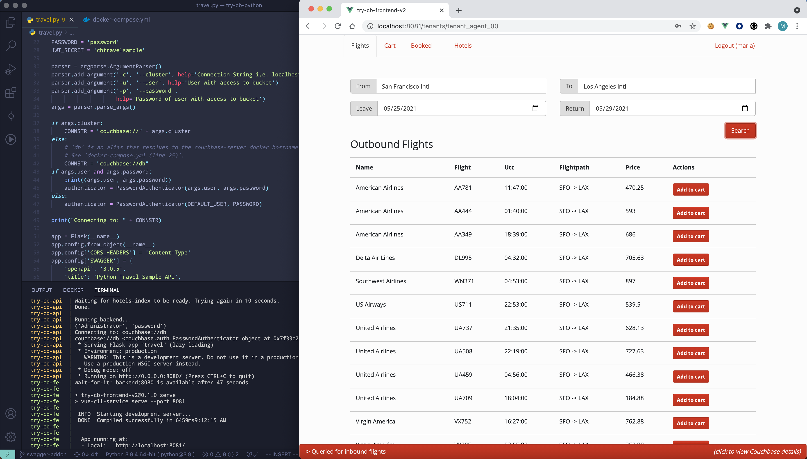

# Couchbase Node.js travel-sample Application REST Backend

This is a sample application for getting started with [Couchbase Server] and the Node.js SDK.
The application runs a single page web UI for demonstrating SQL for Documents (N1QL), Sub-document requests and Full Text Search (FTS) querying capabilities.
It uses Couchbase Server together with the [Express] web framework for [Node.js], [Swagger] for API documentation, [Vue] and [Bootstrap].

The application is a flight planner that allows the user to search for and select a flight route (including the return flight) based on airports and dates.
Airport selection is done dynamically using an autocomplete box bound to N1QL queries on the server side. After selecting a date, it then searches
for applicable air flight routes from a previously populated database. An additional page allows users to search for Hotels using less structured keywords.

## Prerequisites

To download the application you can either download [the archive](https://github.com/couchbaselabs/try-cb-nodejs/archive/master.zip) or clone the repository:

    git clone https://github.com/couchbaselabs/try-cb-nodejs.git

We recommend running the application with Docker, which starts up all components for you,
but you can also run it in a Mix-and-Match style, which we'll decribe below.

## Running the application with Docker

You will need [Docker](https://docs.docker.com/get-docker/) installed on your machine in order to run this application as we have defined a [_Dockerfile_](Dockerfile) and a [_docker-compose.yml_](docker-compose.yml) to run Couchbase Server 7.0.0 beta, the front-end [Vue app](https://github.com/couchbaselabs/try-cb-frontend-v2.git) and the Node.js REST API.

To launch the full application, simply run this command from a terminal:

    docker-compose up

> **_NOTE:_** When you run the application for the first time, it will pull/build the relevant docker images, so it might take a bit of time.

This will start the Node.js backend, Couchbase Server 7.0.0-beta and the Vue frontend app.

You can access the backend API on http://localhost:8080/, the UI on
http://localhost:8081/ and Couchbase Server at http://localhost:8091/

    ❯ docker-compose up
    Docker Compose is now in the Docker CLI, try `docker compose up`

    Creating network "try-cb-nodejs_default" with the default driver
    Pulling db (couchbase/server-sandbox:7.0.0-beta)...
    ...
    Building backend
    ...
    Building frontend
    ...
    Creating couchbase-sandbox-7.0.0-beta ... done
    Creating try-cb-api                   ... done
    Creating try-cb-fe                    ... done
    Attaching to couchbase-sandbox-7.0.0-beta, try-cb-api, try-cb-fe
    couchbase-sandbox-7.0.0-beta | Starting Couchbase Server -- Web UI available at http://<ip>:8091
    couchbase-sandbox-7.0.0-beta | and logs available in /opt/couchbase/var/lib/couchbase/logs
    couchbase-sandbox-7.0.0-beta | Configuring Couchbase Server.  Please wait (~60 sec)...
    try-cb-api  | wait-for-couchbase: checking http://db:8091/pools/default/buckets/travel-sample/
    try-cb-api  | wait-for-couchbase: polling for '.scopes | map(.name) | contains(["inventory", "
    try-cb-fe   | wait-for-it: waiting 400 seconds for backend:8080
    try-cb-api  | wait-for-couchbase: ...
    couchbase-sandbox-7.0.0-beta | Configuration completed!
    couchbase-sandbox-7.0.0-beta | Couchbase Admin UI: http://localhost:8091
    couchbase-sandbox-7.0.0-beta | Login credentials: Administrator / password
    try-cb-api  | wait-for-couchbase: checking http://db:8094/api/cfg
    try-cb-api  | wait-for-couchbase: polling for '.status == "ok"'
    try-cb-api  | wait-for-couchbase: checking http://db:8094/api/index/hotels-index
    try-cb-api  | wait-for-couchbase: polling for '.status == "ok"'
    try-cb-api  | wait-for-couchbase: Failure
    try-cb-api  | wait-for-couchbase: Creating hotels-index...
    try-cb-api  | wait-for-couchbase: checking http://db:8094/api/index/hotels-index/count
    try-cb-api  | wait-for-couchbase: polling for '.count >= 917'
    try-cb-api  | wait-for-couchbase: ...
    ...
    try-cb-api  | wait-for-couchbase: checking http://db:9102/api/v1/stats
    try-cb-api  | wait-for-couchbase: polling for '.indexer.indexer_state == "Active"'
    try-cb-api  | wait-for-couchbase: polling for '. | keys | contains(["travel-sample:def_airport
    try-cb-api  | wait-for-couchbase: polling for '. | del(.indexer) | del(.["travel-sample:def_na
    try-cb-api  | wait-for-couchbase: polling for '. | del(.indexer) | map(.num_pending_requests =
    try-cb-api  | Connecting to backend Couchbase server db with Administrator/password
    try-cb-api  | Example app listening on port 8080!
    try-cb-fe   | wait-for-it: backend:8080 is available after 121 seconds
    try-cb-fe   |
    try-cb-fe   | > try-cb-frontend-v2@0.1.0 serve
    try-cb-fe   | > vue-cli-service serve --port 8081
    try-cb-fe   |
    try-cb-fe   |  INFO  Starting development server...

You should then be able to browse the UI, search for US airports and get flight
route information.

To end the application press <kbd>Control</kbd>+<kbd>C</kbd> in the terminal
and wait for docker-compose to gracefully stop your containers.

## Mix and match services

Instead of running all services, you can start any combination of `backend`,
`frontend`, `db` via docker, and take responsibility for starting the other
services yourself.

As the provided `docker-compose.yml` sets up dependencies between the services,
to make startup as smooth and automatic as possible, we also provide an
alternative `mix-and-match.yml`. We'll look at a few useful scenarios here.

### Bring your own database

If you wish to run this application against your own configuration of Couchbase
Server, you will need version 7.0.0 beta or later with the `travel-sample`
bucket setup.

> **_NOTE:_** if you are not using Docker to start up the API server, or the
> provided wrapper `wait-for-couchbase.sh`, you will need to create a full text
> search index on travel-sample bucket called 'hotels-index'. You can do this
> via the following command:

    curl --fail -s -u <username>:<password> -X PUT \
            http://<host>:8094/api/index/hotels-index \
            -H 'cache-control: no-cache' \
            -H 'content-type: application/json' \
            -d @fts-hotels-index.json

With a running Couchbase Server, you can pass the database details in:

    CB_HOST=10.144.211.101 CB_USER=Administrator CB_PSWD=password docker-compose -f mix-and-match.yml up backend frontend

The Docker image will run the same checks as usual, and also create the
`hotels-index` if it does not already exist.

### Running the Node.js API application manually

You may want to run the Node.js application yourself, to make rapid changes to it,
and try out the features of the Couchbase API, without having to re-build the Docker
image. You may still use Docker to run the Database and Frontend components if desired.

Install the dependencies:

    npm install

Note that `nodemon` is installed as a dev-dependency, so you can run the server with
the benefit of automatic restarting as you make changes.

You will have to point your application at the Couchbase server with the
`CB_HOST` environment variable.

The first time you run against a new database image, you may want to use the provided
`wait-for-couchbase.sh` wrapper to ensure that all indexes are created.
For example, using the Docker image provided:

    docker-compose -f mix-and-match.yml up db

    export CB_HOST=localhost
    ./wait-for-couchbase.sh echo "Couchbase is ready!"
    npx nodemon index.js

If you already have an existing Couchbase server running and correctly configured, you might run:

    CB_HOST=10.144.211.101 CB_USER=Administrator CB_PSWD=password npx nodemon index.js

Finally, if you want to see how the sample frontend Vue application works with your changes,
run it with:

    docker-compose -f mix-and-match.yml up frontend

### Running the front-end manually

To run the frontend components manually without Docker, follow the guide
[here](https://github.com/couchbaselabs/try-cb-frontend-v2)

## REST API reference

We've integrated Swagger/OpenApi version 3 documentation which can be accessed on the backend at `http://localhost:8080/apidocs`

[Couchbase Server]: https://www.couchbase.com/
[Node.js SDK]: https://docs.couchbase.com/nodejs-sdk/current/hello-world/overview.html
[Express]: https://expressjs.com/
[Node.js]: https://nodejs.org/
[Swagger]: https://swagger.io/resources/open-api/
[Vue]: https://vuejs.org/
[Bootstrap]: https://getbootstrap.com/
